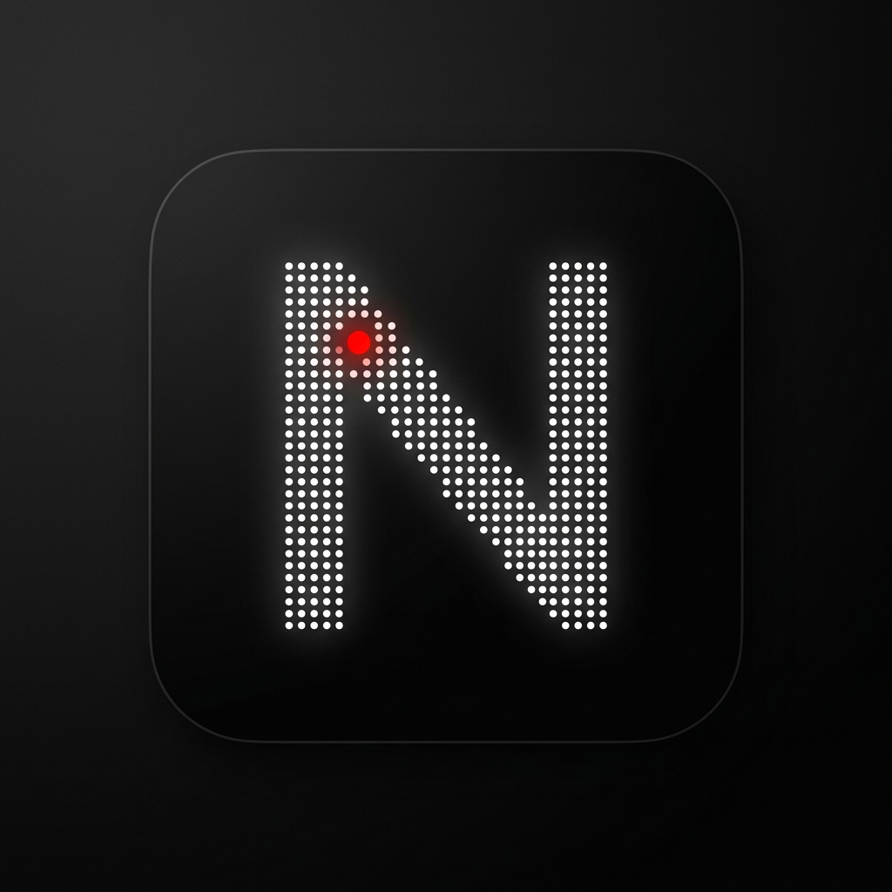

# NOS Gallery - AI-Native Widget Studio & Personalization Platform

<p align="center">
  
</p>

**NOS Gallery** is a premium, developer-grade React Native + Expo SDK widget personalization workspace designed to act as a **"Figma for Home Screens"**. Taking inspiration from Nothing OS, iOS widget stacks, and advanced personalization dashboards, it enables users to build, customize, and automate rich interactive widgets on a live simulator.

---

## 🚀 Key Features

* **550 Widgets Fully Registered**: 100% matched, accounted for, and rendered across 10 functional categories:
  1. **Clock Widgets (60)** - Digital, Analog, Stopwatch, Flip clocks, Retro LED, and World Clocks.
  2. **Calendar Widgets (50)** - Monthly Views, Agenda trackers, and Year Progress.
  3. **Weather Widgets (50)** - Current Conditions, AQI Indexes, Hourly, and Weekly forecasts.
  4. **Productivity Widgets (70)** - Tasks list, Pomodoro Focus mode, Kanban, and Daily Routine.
  5. **Health & Fitness (60)** - Water Intake Tracker, Breathing exercises, Steps metrics, and Fasting logs.
  6. **Finance Widgets (60)** - Stock portfolios, Expense planners, and Crypto Sparklines.
  7. **Developer Widgets (50)** - GitHub Contributions, CI/CD Pipeline monitors, and CPU meters.
  8. **Social Widgets (50)** - Subscriber counters, engagement stats, and Captions generators.
  9. **Smart Home Controls (40)** - Lights, AC, and Device automated Scenes.
  10. **AI Widgets (60)** - Interactive Chat, Daily briefings, and Summary generators.

* **Dynamic User Prompt Configurations**:
  * Selecting templates or packs that require external data (Weather, GitHub Dev, Finance) prompts the user with stylized parameter modals (City, Username, Symbol) before placing the widget.
  * Selecting AI widgets prompts the user to log in with their Google Account, enabling personalized contextual responses using their identity.

* **Semantic Style Token Architecture**:
  * Free of hardcoded hex values for colors.
  * Uses the central `useWidgetStyle` design hook to dynamically resolve theme-specific semantic colors (`successColor`, `errorColor`, `warningColor`) alongside typography and shadow tokens across 10 custom skins (Nothing OS, Cyberpunk, Luxury, Glassmorphism, AMOLED, and more).

* **100% Strict Type-Safety**:
  * Clean `npx tsc --noEmit` checks.
  * Free of `any` types across all 22 widget modules, stores, and layout renderers.

---

## 🛠️ Project Structure

```
├── .github/workflows/
│   └── build-apk.yml        # GitHub Actions APK build & release pipeline
├── assets/images/
│   └── logo_minimal_n.png   # Premium monochrome Nothing-style N logo
├── scripts/
│   ├── validate_widgets.js  # Script to verify all 550 widgets are registered
│   ├── fix_typings.js       # Auto-cleanup for customization props typings
│   └── fix_imports.js       # Imports manager script
├── src/
│   ├── app/                 # Main Expo Router screens
│   ├── editor/              # Widget Studio customization panel
│   ├── gallery/             # Preset packs and marketplace store
│   ├── hooks/               # useWidgetStyle and audio feedback hooks
│   ├── store/               # Zustand store (state management)
│   ├── themes/              # Color palettes, border-radii, and themes definitions
│   └── widgets/             # 10 Widget category implementations and registry
└── widget list.md           # The source widget manifest (550 items)
```

---

## 🚦 Verification & Validations

### 1. Run Automated Widget Integrity Validation
Check if all 550 widgets listed in `widget list.md` are correctly mapped and registered in the registry and renderer:
```bash
node scripts/validate_widgets.js
```

### 2. Verify TypeScript Compilation (Strictly typed, 0 `any` types)
Verify that the codebase complies without any type errors:
```bash
npx tsc --noEmit
```

---

## 🤖 CI/CD APK Build Pipeline
This repository includes a GitHub Actions pipeline under [`.github/workflows/build-apk.yml`](.github/workflows/build-apk.yml). On push or pull request to the `main` branch, the workflow:
1. Installs Node.js & dependencies.
2. Checks TypeScript compilation (`npx tsc --noEmit`).
3. Runs the widget registry validation (`node scripts/validate_widgets.js`).
4. Builds the Android Release APK output using EAS CLI / Expo Build commands.
5. Deploys the compiled APK asset to GitHub Releases.
